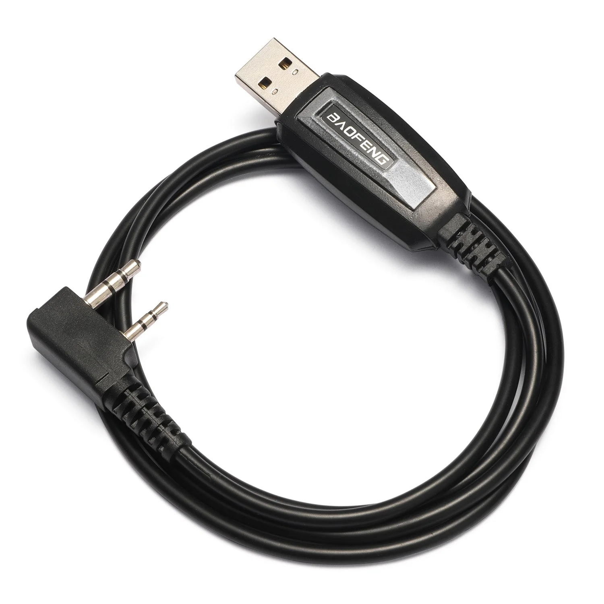

# You need CHIRP!!!

You are reading this documentation in 2025 or later. In this day in age we have some amazing user interfaces that simplify the most complex procedures. Well if you look at your UV-K5 you'll notice that it has 19 buttons and a non-touch screen. I don't think it's a stretch to say that programing your HT is convoluted and slow. That said, there's a way around it's native interface that will let you quickly configure your radio. It's a piece of software called [CHIRP](https://chirpmyradio.com/projects/chirp/wiki/Home). which is a free, open-source tool for programming your radio.

CHIRP allows you to easily configure frequency settings, channels, power levels, and other radio parameters from a computer, rather than manually entering them on the radio itself. Instead of navigating through small radio screens and complex button sequences, CHIRP provides a user-friendly spreadsheet-like interface for managing frequencies and settings. Luckily you can use CHIRP on Windows, MacOS, and Linux.

Before you install CHIRP, you'll need a programming cable to send and receive data from the UV-K5. You'll have to buy a a K-plug programming cable - it's the standard tool needed to program CHIRP. It's a type of radio programming cable that features a dual 3.5mm and 2.5mm plug in a single molded connector, resembling the Kenwood-style speaker/mic jack. In addition to Quansheng, this type of cable is commonly used with many other brands like Baofeng, Kenwood, Wouxun, TYT, and Retevis. Just search for _baofeng programming cable_ on your favorite retailer's website. It will look like this: 
